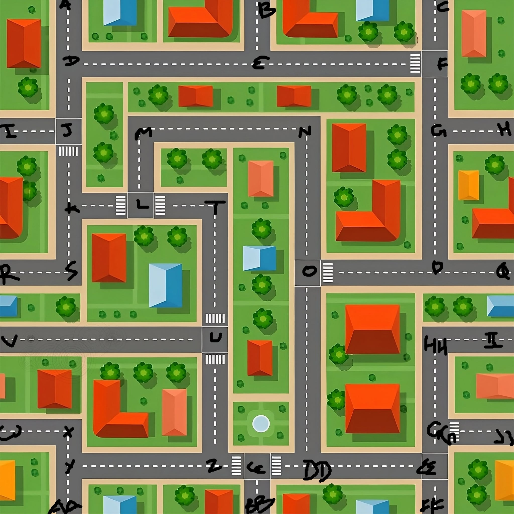
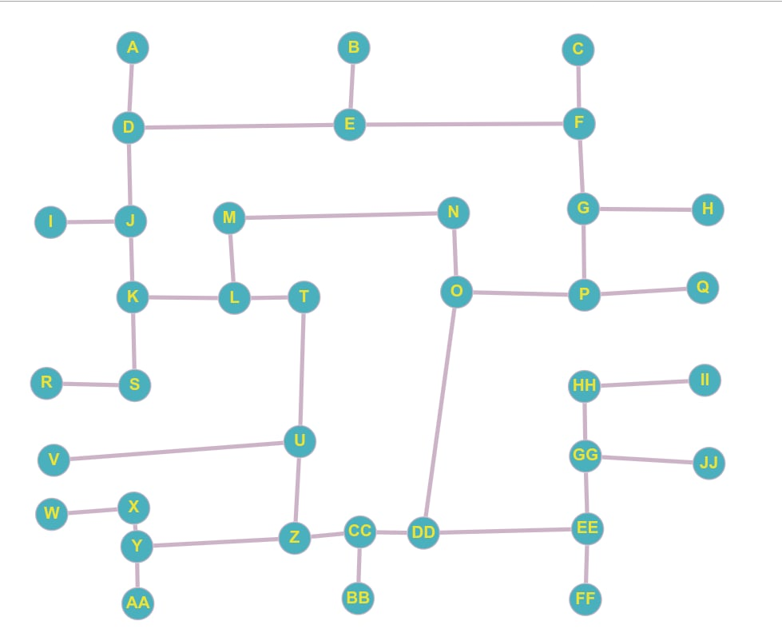
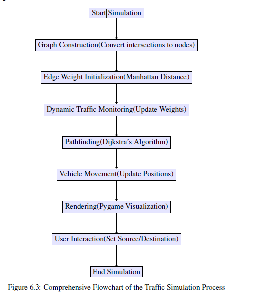

# Traffic Simulation Project

### Introduction

The Traffic Simulator project is a software-based application designed to create a virtual model of how vehicles move through an urban environment. The primary goal of this project is to simulate realistic traffic flow, including vehicle movements, traffic congestion, and the dynamic adjustment of routes based on road conditions. By doing so, it provides a platform to analyze and improve traffic management strategies.
This simulator is developed using Python and incorporates libraries such as Pygame for graphical representation and NetworkX for managing road networks and pathfinding. The interactive and visually engaging nature of the simulator helps users observe how different factors, such as traffic signals, roadblocks, and varying vehicle densities, affect overall traffic flow.
The significance of this project lies in its ability to address real-world traffic problems, particularly urban congestion. By offering insights into how traffic behaves under different conditions, this tool can assist in designing more efficient traffic management systems. It is particularly useful for urban planners, researchers, and policymakers looking to optimize transportation infrastructure and implement smart city solutions.

## Features

- Visual representation of city roads and traffic.
- Graph-based road network with intersections.
- Simulation of vehicle movement.
- Customizable settings and parameters.

## Installation

### Prerequisites

Ensure you have **Python 3.x** installed. You may also need the following dependencies:

```bash
pip install pygame networkx matplotlib
```

### Running the Simulation

Navigate to the project directory and run:

```bash
python traffic/app.py
```

## Project Structure

```
TrafficSim-master/
│── traffic/
│   │── app.py             # Main application script
│   │── city_graph.py      # Graph representation of city roads
│   │── vehicle_class.py   # Vehicle movement logic
│   │── utility_func.py    # Utility functions
│   ├── src/
│   │   ├── fonts/
│   │   ├── images/
│   │   │   ├── city.jpg
│   │   │   ├── city_graph.jpeg
│   │   │   ├── location_icon.png
│   │── menu_bar.png
│── .gitignore
```

## Approach

The key stages in our approach are:
i. Graph Construction: Convert physical road intersections into nodes and the connect-
ing roads into edges, thereby translating a city layout into an undirected graph using the
NetworkX library.
ii. Road Intersection Conversion: Map each road intersection from urban mapping data
to a corresponding node in the graph. This step ensures that the spatial relationships
between intersections are accurately preserved, reflecting the actual layout of the city.
iii. Edge Weight Initialization: Assign each edge an initial weight based on the Manhat-
tan distance between connected nodes. This baseline metric is essential for computing
optimal routes.
iv. Dynamic Traffic Monitoring: Continuously monitor the number of vehicles on each
road segment, updating edge weights in real-time to reflect traffic congestion and adjust
route calculations accordingly.
v. Pathfinding and Simulation Execution: Implement a Dijkstra’s algorithm that incor-
porates dynamic edge weights to compute the most efficient routes. The simulation en-
gine, developed using Pygame, updates vehicle positions and renders the environment
in real time.

# simplified city map with intersection and road segments



# graph representation of city after transformation



## Process flow diagram

To visually encapsulate the entire simulation process, we present the following flow chart.
This diagram details the progression from initial graph construction through to dynamic
rendering and user interaction


## Contributing

We welcome contributions to improve the project further..
